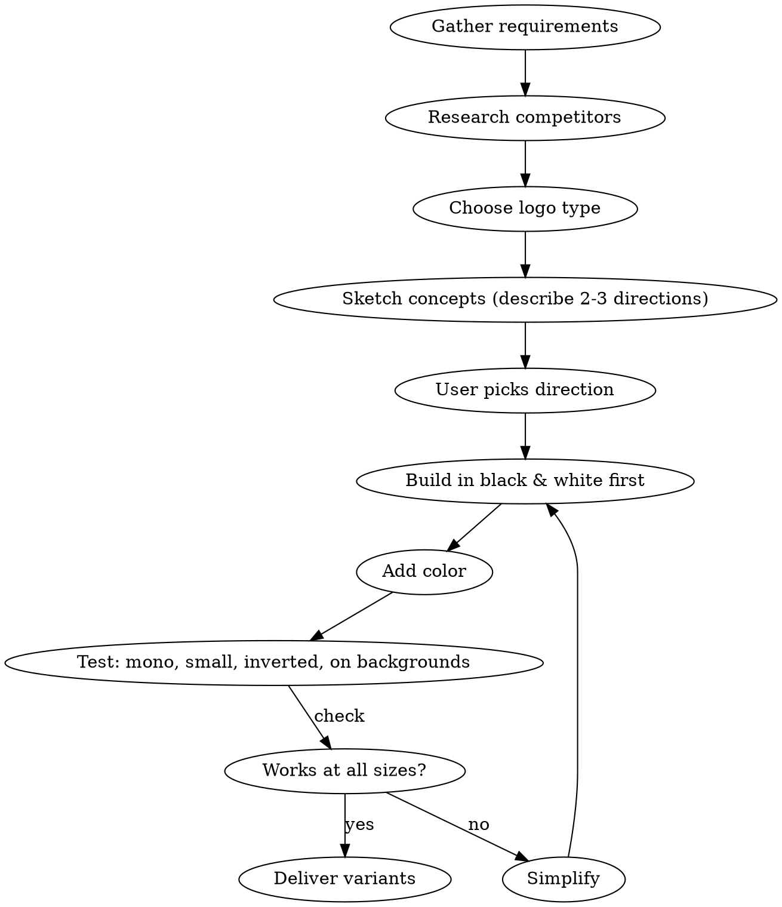

# Logo Design

Create distinctive, production-quality logos as clean SVG code. Logos must be simple, memorable, scalable, and purposeful - not generic clip art or AI slop.

## Before You Start

Ask or determine:
1. **Brand name** and what the brand does
2. **Logo type** preference (or recommend one):
   - **Wordmark** - brand name in styled typography (Google, Coca-Cola, FedEx). Best for short, distinctive names.
   - **Lettermark** - initials/monogram (IBM, HBO, CNN). Best for long company names.
   - **Pictorial mark** - iconic symbol (Apple, Twitter bird, Target). Best for established brands or universal concepts.
   - **Abstract mark** - geometric abstraction (Pepsi, Adidas, BP). Best when you need a unique, ownable symbol.
   - **Combination mark** - symbol + wordmark together (Burger King, Lacoste, Doritos). Best for new brands needing both recognition paths.
   - **Emblem** - text inside a symbol/badge/crest (Starbucks, Harley-Davidson, Ford). Best for heritage, authority, or institutional feel.
3. **Personality/tone** - modern, classic, playful, minimal, bold, elegant, technical, organic
4. **Color preferences** or let the design guide color choice
5. **Industry context** - match design to sector expectations while standing apart from competitors

## Core Principles

### Simplicity First
- Limit to 1-3 key shapes. The simpler the design, the more recognizable it becomes.
- Every element must earn its place. If removing it doesn't hurt, remove it.
- The logo must be recognizable as a tiny favicon (16x16) and on a billboard.
- Run the mental "sketch test": could someone draw this from memory after seeing it for 5 seconds?

### Meaningful Design
- Shapes, colors, and typography should reflect the brand's identity and values.
- Avoid decoration for decoration's sake. Every curve, angle, and color choice should be intentional.
- Use negative space to create secondary meanings (the FedEx arrow, the Spartan Golf Club golfer).
- Symbols communicate intuitively - they bypass the interpretive steps words require.
- Use visual metaphors to pack multiple layers of meaning into one mark. The "aha!" factor makes logos memorable.
- Don't be too literal. Abstract marks endure better than literal representations. A logo establishes identity - it doesn't need to show what the company does.

### Scalability
- Design as vector SVG - never raster.
- Test mentally at multiple sizes: favicon, mobile app icon, social media profile, letterhead, signage, billboard.
- Verify at ~0.5 inches wide - all details must remain legible.
- Ensure the logo works in single color (black on white, white on black) before adding color.

### Timelessness Over Trends
- Avoid trendy effects that will date the logo within 2 years.
- Classic geometric forms, clean typography, and restrained color age well.
- Think evolution, not revolution - great logos (Apple, UPS, Starbucks) refine their silhouette over decades while remaining recognizable.
- If the logo would look out of place 10 years from now, simplify.

### Originality
- Research the brand's competitors and deliberately avoid their visual patterns.
- Avoid generic symbols: lightbulbs for ideas, globes for international, swooshes for tech.
- Custom symbols, modified letterforms, or unique monograms create ownable marks.

## Color Guidelines

### Psychology Quick Reference

| Color | Associations | Common in |
|-------|-------------|-----------|
| Blue | Trust, stability, professionalism | Finance, tech, healthcare |
| Red | Energy, urgency, passion | Food, entertainment, retail |
| Green | Growth, nature, health | Eco, wellness, agriculture |
| Yellow/Gold | Optimism, warmth, premium | Luxury, food, energy |
| Purple | Creativity, luxury, wisdom | Beauty, education, spirituality |
| Orange | Friendly, energetic, affordable | Youth brands, tech startups |
| Black | Sophistication, luxury, power | Fashion, luxury, editorial |
| White | Clean, minimal, pure | Tech, healthcare, modern brands |

### Rules
- **Monochrome first** - always design in black and white. If it works without color, it works everywhere. Color should amplify the concept, not replace it.
- **Max 3 colors** - a primary, secondary, and optional accent.
- **60-30-10 ratio** - dominant, secondary, accent distribution.
- **Contrast matters** - the logo must remain legible on light and dark backgrounds.
- **Cultural awareness** - colors carry different meanings across cultures. Research target markets.
- Document exact color values in all formats: HEX, RGB, HSL, and Pantone/CMYK for print.

## Typography Rules (for wordmarks, lettermarks, combination marks)

### Font Personality
- **Serif** = tradition, reliability, formality (law firms, publishers, luxury)
- **Sans-serif** = modern, clean, accessible (tech, startups, lifestyle)
- **Geometric sans** = precision, engineering, forward-thinking
- **Humanist sans** = warm, approachable, friendly
- **Script/hand-drawn** = personal, creative, artisanal (use sparingly, must remain legible at all sizes)

### Execution
- Convert text to paths in the final SVG for font independence.
- Limit to 1-2 typefaces maximum. The graphic mark and typeface should form a unified "lockup" that enhances each other.
- Adjust letter-spacing (tracking) for balance - tight for bold impact, loose for elegance.
- Ensure optical alignment - mathematical centering often looks off; trust the eye.
- Custom modify at least one letterform to make the wordmark ownable.
- Test the chosen typeface at very small sizes for legibility.

## SVG Code Standards

### Structure
```svg
<svg xmlns="http://www.w3.org/2000/svg" viewBox="0 0 [width] [height]" role="img" aria-label="[Brand] logo">
  <title>[Brand] Logo</title>
  <g id="icon">...</g>
  <g id="wordmark">...</g>
</svg>
```

### Best Practices
- Use `viewBox` instead of fixed width/height for responsive scaling.
- Prefer basic shapes (`rect`, `circle`, `ellipse`, `polygon`) over complex paths when possible - they're more readable and editable.
- Use `<defs>` for gradients, patterns, and reusable elements.
- Keep paths clean - minimize control points, use smooth curves.
- Group related elements with `<g>` and meaningful IDs.
- Include `role="img"` and `aria-label` for accessibility.
- Include `<title>` element for screen readers.
- Avoid inline styles when attributes work (`fill`, `stroke`, `opacity`).
- No raster image embeds (`<image>`) - pure vector only.
- Optimize: remove redundant transforms, merge overlapping paths, clean decimal precision to 2 places.
- Avoid thin lines or excessive detail that disappears at small sizes.

### Gradients (Use Sparingly)
```svg
<defs>
  <linearGradient id="brand-gradient" x1="0%" y1="0%" x2="100%" y2="100%">
    <stop offset="0%" stop-color="#color1"/>
    <stop offset="100%" stop-color="#color2"/>
  </linearGradient>
</defs>
```
- Gradients add depth but reduce versatility. The logo must also work flat.
- Limit to 2-3 stops maximum.
- Strip away shadows, bevels, and non-essential effects that complicate scaling.

## Design Process



1. **Gather requirements** - brand name, industry, personality, audience, preferences
2. **Research competitors** - identify visual patterns in the space to deliberately avoid
3. **Choose logo type** - recommend based on brand needs (name length, recognition goals, application contexts)
4. **Sketch concepts** - describe 2-3 distinct design directions with rationale before coding. Explain the visual metaphor, personality, and why each direction fits the brand.
5. **User picks direction** - get alignment before writing SVG
6. **Build in black and white** - the concept must work without color
7. **Add color** - apply color strategy that amplifies the concept
8. **Test versatility** - verify it works monochrome, tiny, inverted, on dark/light/textured backgrounds
9. **Deliver variants** - full set of logo versions

## Deliverables

For each logo, produce:
1. **Primary SVG** - full color version
2. **Monochrome SVG** - single color (black) version
3. **Reversed SVG** - white version for dark backgrounds
4. **Favicon variant** - simplified version that reads at 16x16 (if the primary is too complex)

Also provide:
- Clear space guidance (minimum padding around the logo)
- Color values documented (HEX, RGB, HSL)
- Brief usage notes: what not to do (stretch, recolor, add effects)

## Validation Checklist

Before delivering, verify:
- [ ] Works in pure black on white background
- [ ] Works in pure white on black background
- [ ] Legible at favicon size (16x16)
- [ ] No thin lines that disappear at small sizes
- [ ] No more than 3 colors
- [ ] Text converted to paths
- [ ] Uses viewBox, not fixed dimensions
- [ ] Includes accessibility attributes (role, aria-label, title)
- [ ] No generic/cliche symbols
- [ ] Concept can be described in one sentence

## Common Mistakes

| Mistake | Fix |
|---------|-----|
| Too many colors | Limit to 3. Start with monochrome. |
| Overly complex paths | Simplify. If you can't describe the shape in one sentence, it's too complex. |
| Fixed width/height instead of viewBox | Always use viewBox for responsive scaling. |
| Text not converted to paths | Convert to paths for font independence. |
| Looks great large, illegible small | Design at small size first, then scale up. |
| Following trends over fundamentals | Geometric clarity and clean typography outlast gradients and effects. |
| Centering by math instead of by eye | Optical centering often requires manual adjustment. |
| No monochrome version | Every logo must work in pure black and pure white. |
| Generic shapes (lightbulb, globe, swoosh) | Find a unique visual metaphor specific to the brand. |
| Too literal (showing what the company does) | Abstract marks endure better. Establish identity, don't illustrate services. |
| Mismatched type and mark | The graphic and typeface must complement each other as a unified lockup. |
| No clear space defined | Specify minimum padding to prevent the logo from being crowded. |
| Ignoring cultural context | Research color and symbol meanings in target markets. |

---

## Social Media Graphics

When creating social media assets (profile images, banners, cover photos, post graphics, stories, carousels), apply the logo design principles above plus these platform-specific guidelines.

### The Attention Window

- You have **less than 1 second** to stop a scroller - treat every graphic like a road sign: one message, one emotion, one goal.
- 90% of information reaching the brain is visual. Clarity beats decoration for platform performance.
- Visual content is **40x more likely to be shared** than text-only content.
- Commit to one message and one proof point per graphic. Complex collages lose to focused compositions in busy feeds.

### Platform Sizing Reference

Always create to exact specs - never stretch or force-crop a single asset across platforms. **Recompose** layouts for each aspect ratio rather than simply cropping.

| Platform | Profile | Cover/Banner | Post (Feed) | Story/Reel |
|----------|---------|-------------|-------------|------------|
| **X (Twitter)** | 400x400 | 1500x500 | 1600x900 (16:9) | - |
| **LinkedIn** | 400x400 | 1584x396 | 1200x627 | - |
| **Facebook** | 170x170 | 820x312 | 1200x630 | 1080x1920 |
| **Instagram** | 320x320 | - | 1080x1080 (square), 1080x1350 (portrait) | 1080x1920 |
| **GitHub** | 500x500 | 1280x640 (social preview) | - | - |
| **YouTube** | 800x800 | 2560x1440 | 1280x720 (thumbnail) | 1080x1920 |
| **Desktop wallpaper** | - | - | 3840x2160 (4K) | - |
| **Phone wallpaper** | - | - | 1290x2796 (iPhone 15 Pro Max) | - |

### Design Rules for Social

**Composition:**
- Single focal point - answer "where should the eye go first?" before designing anything.
- Use size, color, and spacing to guide attention naturally.
- Follow the rule of thirds for element placement.
- White space is critical at small sizes - overcrowded designs fail on mobile.
- Balance text and visuals proportionally; avoid text overload.
- Group related items together; separate sections with generous whitespace.

**Typography:**
- Bold, wide typefaces outperform thin fonts on mobile (thin fonts vanish at small sizes).
- Maximum **2 fonts** per graphic: one headline, one support. More creates noise.
- Keep text concise - fewer words always wins on social.
- Ensure 4.5:1 minimum contrast ratio between text and background (WCAG AA).
- Test at actual mobile display sizes, not just in design tools.

**Color:**
- Consistent brand colors increase recognition by **up to 80%**.
- High contrast is mandatory for mobile readability (sunlight, small screens).
- Bright, saturated colors boost engagement in feeds.
- Never rely solely on color to convey meaning - use shape and text differentiation for accessibility.

**Mobile-first:**
- Mobile is the primary social media access point. If it doesn't work on phones, it fails.
- Keep important elements and CTAs within the "thumb zone."
- Avoid small text sizes - test on actual devices before publishing.
- Preview all posts before publishing to confirm nothing is cropped.

### Platform Tone Matching

| Platform | Tone | What works |
|----------|------|-----------|
| **Instagram/Threads** | Visual, bold | High-contrast colors, bold typography, square/vertical formats |
| **LinkedIn** | Professional, clean | Clean layouts, readable text, clarity over decoration |
| **X (Twitter)** | Punchy, direct | Simple graphics with strong headlines, punchy over ornate |
| **Facebook** | Accessible, clear | Clean layouts, readable text, straightforward messaging |
| **GitHub** | Technical, precise | Monospace elements, developer-native aesthetic, clean and minimal |

### Motion and Animation

- Subtle animations outperform flashy effects - motion should guide the eye, not distract.
- Blinking arrows, sliding text, pulsing CTAs can **double engagement** over static graphics.
- Motion reveals information and draws attention to the focal point.
- Always provide static fallbacks for accessibility.
- Keep animations short and purposeful - avoid spinning or bouncing for its own sake.

### Brand Consistency Across Social

- Consistent presentation across templates makes a brand **3-4x more likely** to see increased visibility.
- Create **2-3 reusable SVG templates** for recurring content types (announcements, quotes, features, stats).
- Store brand tokens (colors, fonts, spacing, logo variants) in a central reference.
- Include company name or website unless the logo is universally recognized.
- Audit social profiles regularly - ensure all platforms match current brand guidelines.
- When producing a full social media kit, deliver dark and light variants of every asset.

### Content Type Effectiveness

Ranked by engagement and distinctiveness in feeds:
1. **Original graphics and illustrations** - stand out most in algorithmically sorted feeds
2. **Infographics** - receive 3x more likes and shares than other content types
3. **Carousels** - keep viewers engaged longer, boost algorithm reach
4. **Short animations/GIFs** - capture attention more effectively than static images
5. **Quote cards** - highly shareable, reflect brand values
6. **Data visualizations** - best for communicating complex information simply
7. **Screenshots** - replace lengthy descriptions with visual proof

### Social Media Deliverables

When producing a complete social media graphics kit, deliver:

1. **Profile image** - icon-only version optimized for circular crop (all platforms)
2. **Cover/banner** - platform-specific sizes for each target platform (dark + light variants)
3. **OG/social preview image** - for link sharing (1200x630 is the most universal)
4. **Post templates** - 2-3 reusable layouts for recurring content types
5. **Story templates** - vertical 1080x1920 layouts if the brand uses stories
6. **Color-on-dark and color-on-light** versions of every asset
7. **Favicon set** - 16px through 512px for web use

### Social Graphics Validation Checklist

Before delivering social assets, verify:
- [ ] Each asset is sized to exact platform specs (not stretched or force-cropped)
- [ ] Text is legible at actual mobile display size
- [ ] Contrast ratio meets 4.5:1 minimum (WCAG AA)
- [ ] Logo/brand mark survives circular crop (profile images)
- [ ] Important elements are not in crop danger zones (corners, edges)
- [ ] Dark and light variants provided
- [ ] One clear focal point per graphic
- [ ] Maximum 2 fonts used
- [ ] Alt-text descriptions provided for accessibility
- [ ] Previewed on actual mobile device or at mobile resolution

### Testing and Iteration

- A/B test layouts, color variations, and text placement when possible.
- Design tests with specific hypotheses, not random splits.
- Track hook rate, saves, qualified clicks, and engagement metrics.
- Promote winning visual patterns into the design system; retire patterns that underperform twice consecutively.
- Connect creative performance to business outcomes - not just vanity metrics.
