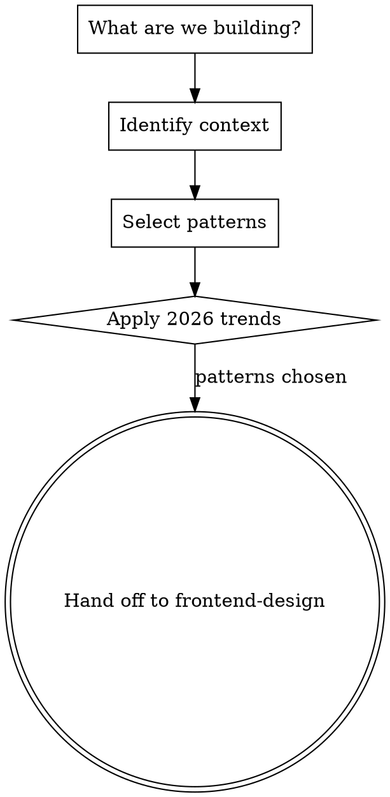

# Web Design Pattern Selection

Context-aware design decisions based on what you're building. This skill selects the right patterns; `frontend-design` executes them with aesthetic quality.

## Process

1. **Identify context**: What type of site/app? What industry? What audience?
2. **Select patterns**: Consult reference files for layout, typography, color, and visual style matched to context
3. **Apply trends**: Layer in current design trends where they serve the project
4. **Hand off**: Pass chosen patterns as constraints to `frontend-design` for implementation

## Context Detection

| Building | Consult |
|----------|---------|
| SaaS landing page | [industry-patterns](reference/industry-patterns.md) > SaaS, [layout](reference/layout-recipes.md) > Hero patterns |
| Dashboard / admin panel | [industry-patterns](reference/industry-patterns.md) > Dashboards, [layout](reference/layout-recipes.md) > Data layouts |
| E-commerce | [industry-patterns](reference/industry-patterns.md) > E-commerce, [layout](reference/layout-recipes.md) > Product grids |
| Portfolio | [industry-patterns](reference/industry-patterns.md) > Portfolio, [layout](reference/layout-recipes.md) > Gallery/editorial |
| Service / public sector | [industry-patterns](reference/industry-patterns.md) > Service, [layout](reference/layout-recipes.md) > Information-first |
| Landing page | [industry-patterns](reference/industry-patterns.md) > Landing Pages, [layout](reference/layout-recipes.md) > CTAs + Hero patterns |
| Business website | [industry-patterns](reference/industry-patterns.md) > Business, [layout](reference/layout-recipes.md) > Content sections |
| Personal site / portfolio | [industry-patterns](reference/industry-patterns.md) > Personal + Portfolio, [layout](reference/layout-recipes.md) > Gallery |
| Web application | [industry-patterns](reference/industry-patterns.md) > Web apps, [layout](reference/layout-recipes.md) > App shells |

Always consult:
- [typography-guide](reference/typography-guide.md) for font selection and pairing
- [color-palettes](reference/color-palettes.md) for palette strategy
- [trends-2026](reference/trends-2026.md) for current design language

Consult as needed:
- [design-fundamentals](reference/design-fundamentals.md) for golden ratio, Fitts' law, visual hierarchy, graphic design principles, interaction design, simplicity, and SCAMPER iteration
- [accessibility-and-ethics](reference/accessibility-and-ethics.md) for WCAG compliance, inclusive design, dark pattern avoidance, consistency rules, mobile-first strategy, and website structure/information architecture
- [benchmarks](reference/benchmarks.md) for data-driven decisions: performance targets, mobile statistics, conversion rates, accessibility compliance data

## Key Principles

- Match patterns to context. A hospital dashboard needs different design decisions than a gaming portfolio. Never apply patterns generically.
- Accessibility is non-negotiable. WCAG AA contrast, keyboard navigation, screen reader support, and touch targets on every project.
- Mobile-first. Start with the smallest screen, progressively enhance. Content prioritization on mobile produces cleaner interfaces overall.
- Content before chrome. Real words and real data before visual polish. Design around actual content lengths.
- Simplicity through progressive disclosure. Reveal complexity in measured steps, not all at once.

## Working With frontend-design

This skill runs first. State your chosen patterns explicitly, then let `frontend-design` handle aesthetic execution. Example internal note:

> "Building a SaaS analytics landing page. Patterns: bento grid layout, dark mode with high-contrast CTAs, bold sans-serif headings (Space Grotesk + Inter), monochromatic blue palette with accent orange. Now applying frontend-design for implementation."
